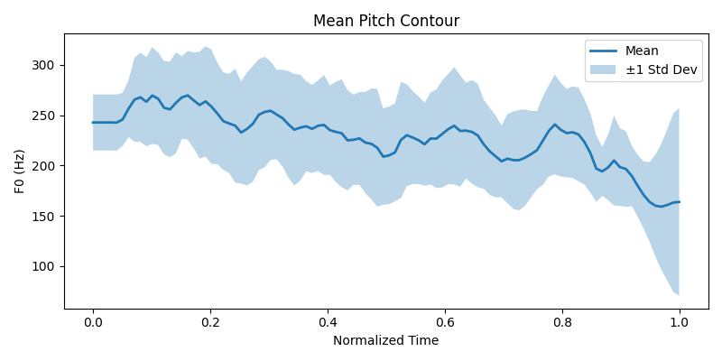

# Prosody Analysis (Japanese)

Quantitative analysis of Japanese pitch-accent and timing patterns using Python and MATLAB.

This project studies how pitch changes over time in spoken Japanese.

Using Python, I extract the pitch (fundamental frequency) from audio recordings and convert each sentence into a standardized numerical representation. Each utterance is normalized and resampled onto a fixed 100-point time grid, allowing different sentences to be compared mathematically.

The goal is to analyze patterns in speech intonation using interpretable signal-processing methods — not speech recognition or machine learning.

## Dataset

Using [JSUT (Japanese speech corpus of Saruwatari-lab., University of Tokyo)](https://sites.google.com/site/shinnosuketakamichi/publication/jsut) for sample data presently. Future plans to use personal recordings for more specific utterances.

## Mean Pitch Contour

This figure shows the mean pitch contour computed from 20 distinct utterances. Each utterance was normalized to the interval [0,1] and resampled to 100 time points before averaging.

# Future goals
- Pitch comparisons on words for different speakers
- pitch analysis to understand individual words and their specific utterances