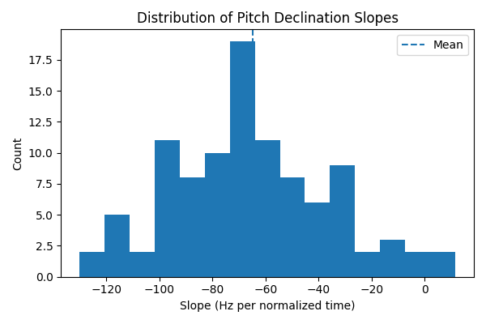

# Prosody Analysis (Japanese)

Quantitative analysis of Japanese pitch-accent and timing patterns using Python and MATLAB.

This project studies how pitch changes over time in spoken Japanese.

Using Python, I extract the pitch (fundamental frequency) from audio recordings and convert each sentence into a standardized numerical representation. Each utterance is normalized and resampled onto a fixed 100-point time grid, allowing different sentences to be compared mathematically.

The goal is to analyze patterns in speech intonation using interpretable signal-processing methods — not speech recognition or machine learning.

## Dataset

Using [JSUT (Japanese speech corpus of Saruwatari-lab., University of Tokyo)](https://sites.google.com/site/shinnosuketakamichi/publication/jsut) for sample data presently. Future plans to use personal recordings for more specific utterances.

## Mean Pitch Contour

This figure shows the mean pitch contour computed from 20 distinct utterances. Each utterance was normalized to the interval [0,1] and resampled to 100 time points before averaging.

## Pitch Declination Analysis

To measure overall pitch movement in declarative Japanese speech, I fit a linear trend to each normalized pitch contour (100 utterances, each resampled to 100 time points).

**Results**

- Mean slope: **−64.92 Hz**
- Standard deviation: **29.58 Hz**
- 98 out of 100 utterances show negative slope

This indicates consistent downward pitch drift (declination) across sentences in this dataset.

## Business & Applied Perspective

This project demonstrates:

- Signal processing of real-world audio data  
- Feature extraction from unstructured inputs  
- Time normalization and vectorization of variable-length signals  
- Statistical modeling (regression, SVD, PCA)  
- Building a reproducible, modular analysis pipeline  

These skills directly apply to:

- Speech analytics and voice technology  
- Audio-based product development  
- Quantitative signal modeling  
- Feature engineering for machine learning systems  

At its core, this project shows the ability to turn raw data into structured numerical representations and extract measurable patterns using interpretable mathematical methods.

# Future goals
- Pitch comparisons on words for different speakers
- pitch analysis to understand individual words and their specific utterances